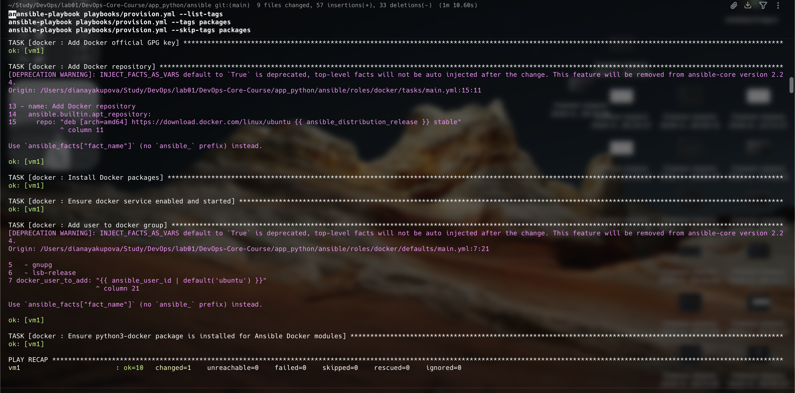
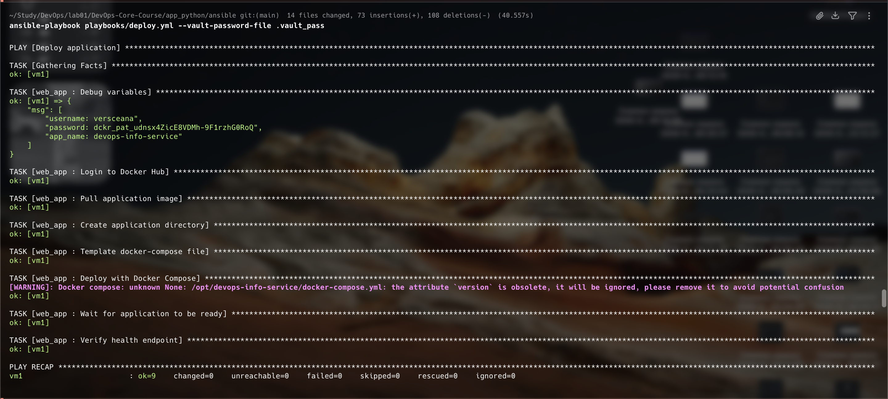
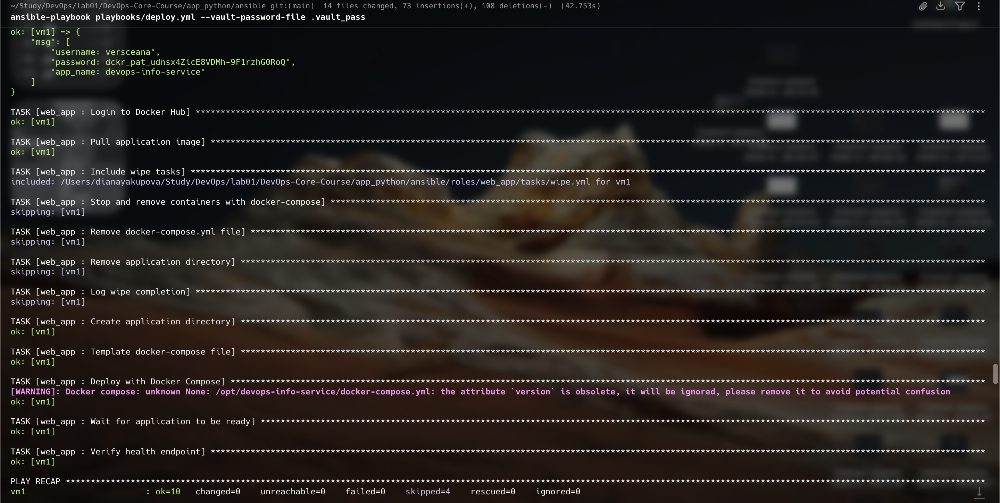
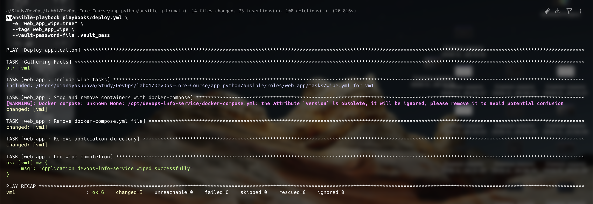
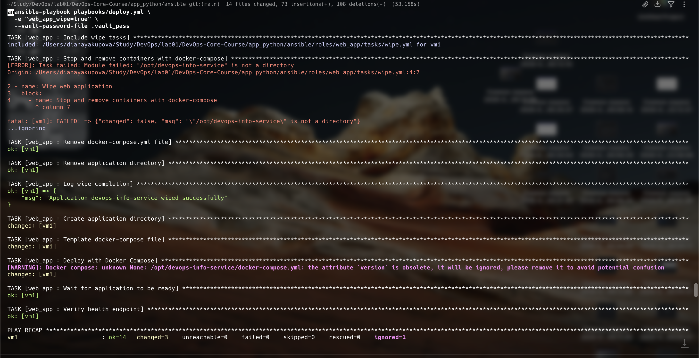
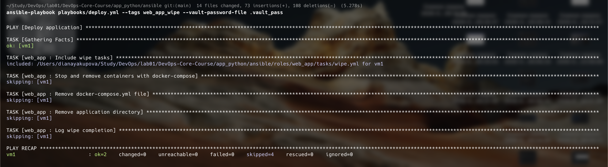

# Lab 6 — Advanced Ansible & CI/CD

**Name:** Diana Yakupova  
**Group:** B23-CBS-02  
**Date:** 2026-03-19  

---

## Overview

- **Ansible version:**  
 
- **Target VM:** AWS EC2 (t2.micro, Ubuntu 24.04 LTS), IP: `50.16.50.40` (updated after restart).  
- **Technologies used:** Ansible 2.16+, Docker Compose v2, GitHub Actions, Jinja2.  
- **Key improvements over Lab 5:**  
  - Blocks and tags for better task grouping and selective execution.  
  - Docker Compose deployment with templated configuration.  
  - Safe wipe logic with variable + tag double‑gating.  
  - Automated CI/CD pipeline with ansible‑lint and deployment verification.  

---

## 1. Blocks & Tags

### 1.1 Refactored `common` role
- Package installation tasks grouped in a block with tag `packages`.  
- `rescue` block handles apt cache failures by running `apt-get update --fix-missing`.  
- `always` block creates a log file in `/tmp/ansible-common.log`.  
- Applied tags: `packages`, `system`, `common`, `always`.  

### 1.2 Refactored `docker` role
- Docker installation tasks grouped under `docker_install` tag, configuration under `docker_config`.  
- `rescue` retries GPG key addition on failure (3 attempts, 10s delay).  
- `always` ensures Docker service is started even if installation partially fails.  
- Role tags: `docker`, `docker_install`, `docker_config`.  

### 1.3 Tag listing and selective execution

**List all available tags:**
```bash
ansible-playbook playbooks/provision.yml --list-tags
```
```
playbook: playbooks/provision.yml
  play #1 (webservers): Provision web servers	TAGS: []
      TASK TAGS: [common, packages, system]
```

**Run only `packages` tasks:**
```bash
ansible-playbook playbooks/provision.yml --tags packages
```
```
TASK [common : Update apt cache] **********************************************
ok: [vm1]
TASK [common : Install common packages] ****************************************
ok: [vm1]
...
```

**Skip `packages` tasks:**
```bash
ansible-playbook playbooks/provision.yml --skip-tags packages
```
System tasks and Docker role still run:
```
TASK [common : Set timezone to UTC] ********************************************
ok: [vm1]
TASK [docker : Install prerequisites for Docker apt repo] **********************
ok: [vm1]
...
```



### 1.4 Research Questions
- **What happens if rescue block also fails?**  
  The playbook stops with an error; rescue does not catch its own failures. Nested blocks or `ignore_errors` can be used for more robust handling.  
- **Can you have nested blocks?**  
  Yes, blocks can be nested, allowing multiple levels of error handling.  
- **How do tags inherit to tasks within blocks?**  
  Tags applied at the block level are inherited by all tasks inside, unless a task overrides them with its own tags.

---

## 2. Docker Compose Migration

### 2.1 Role rename and dependencies
```bash
cd ansible/roles
mv app_deploy web_app
```
Added role dependency in `roles/web_app/meta/main.yml`:
```yaml
---
dependencies:
  - role: docker
```

### 2.2 Docker Compose template
**File:** `roles/web_app/templates/docker-compose.yml.j2`
```yaml
version: '3.8'

services:
  {{ app_name }}:
    image: {{ docker_image }}:{{ docker_tag }}
    container_name: {{ app_name }}
    ports:
      - "{{ app_port }}:{{ app_internal_port }}"
    environment:
      - PORT={{ app_internal_port }}
    restart: {{ restart_policy }}
    networks:
      - app_network

networks:
  app_network:
    driver: bridge
```

### 2.3 Variables configuration
After editing with `ansible-vault`, `group_vars/all.yml` contains:
```yaml
app_name: devops-info-service
docker_image: versceana/devops-info-service
docker_tag: latest
app_port: 8000
app_internal_port: 5000
compose_project_dir: "/opt/{{ app_name }}"
restart_policy: unless-stopped
```

### 2.4 Deployment and idempotency

**First run (creates resources):**
```bash
ansible-playbook playbooks/deploy.yml --vault-password-file .vault_pass
```
```
TASK [web_app : Create application directory] **********************************
changed: [vm1]
TASK [web_app : Template docker-compose file] **********************************
changed: [vm1]
TASK [web_app : Deploy with Docker Compose] ************************************
changed: [vm1]
...
PLAY RECAP: vm1 : ok=9 changed=3
```


**Second run (idempotent – all `ok`, `changed=0`):**
```bash
ansible-playbook playbooks/deploy.yml --vault-password-file .vault_pass
```
```
TASK [web_app : Deploy with Docker Compose] ************************************
ok: [vm1]
...
PLAY RECAP: vm1 : ok=9 changed=0
```


### 2.5 Verification
```bash
ansible webservers -a "docker ps" --vault-password-file .vault_pass
```
```
CONTAINER ID   IMAGE                                  ... PORTS                               NAMES
xxxxxxxxxxxx   versceana/devops-info-service:latest   ... 0.0.0.0:8000->5000/tcp, 5000/tcp   devops-info-service
```

```bash
ansible webservers -a "curl -s http://127.0.0.1:8000/health" --vault-password-file .vault_pass
```
```
{"status":"healthy","timestamp":"...","uptime_seconds":...}
```

### 2.6 Research Questions
- **Difference between `restart: always` and `restart: unless-stopped`?**  
  `always` restarts the container even if stopped manually; `unless-stopped` only restarts if it was not explicitly stopped.  
- **How do Docker Compose networks differ from Docker bridge networks?**  
  Compose creates a dedicated network per project, isolating containers of different projects.  
- **Can you reference Ansible Vault variables in the template?**  
  Yes, templates are processed by Ansible and vault variables are automatically decrypted when the playbook runs with the correct password.

---

## 3. Wipe Logic

### 3.1 Implementation
- Variable `web_app_wipe: false` in `roles/web_app/defaults/main.yml`.
- Wipe tasks in `roles/web_app/tasks/wipe.yml`:
  ```yaml
  - name: Wipe web application
    block:
      - name: Stop and remove containers with docker-compose
        community.docker.docker_compose_v2:
          project_src: "{{ compose_project_dir }}"
          state: absent
          remove_volumes: yes
        ignore_errors: yes
      - name: Remove docker-compose.yml file
        file: path="{{ compose_project_dir }}/docker-compose.yml" state=absent
        ignore_errors: yes
      - name: Remove application directory
        file: path="{{ compose_project_dir }}" state=absent
        ignore_errors: yes
      - name: Log wipe completion
        debug: msg="Application {{ app_name }} wiped successfully"
    when: web_app_wipe | bool
    tags: web_app_wipe
  ```
- Included in `main.yml` before deployment tasks with `include_tasks` and tag `web_app_wipe`.

### 3.2 Test Scenarios

**Scenario 1 – Normal deployment (wipe skipped)**
```bash
ansible-playbook playbooks/deploy.yml --vault-password-file .vault_pass
```
Wipe tasks are not executed (default variable `false`).  



**Scenario 2 – Wipe only (variable true + tag)**
```bash
ansible-playbook playbooks/deploy.yml -e "web_app_wipe=true" --tags web_app_wipe --vault-password-file .vault_pass
```
Only wipe tasks run, deployment tasks skipped.
```
TASK [web_app : Stop and remove containers with docker-compose] ****************
changed: [vm1]
TASK [web_app : Remove docker-compose.yml file] ********************************
changed: [vm1]
TASK [web_app : Remove application directory] **********************************
changed: [vm1]
TASK [web_app : Log wipe completion] *******************************************
ok: [vm1]
PLAY RECAP: ok=6 changed=3
```


**Scenario 3 – Clean reinstallation (variable true, no tag)**
```bash
ansible-playbook playbooks/deploy.yml -e "web_app_wipe=true" --vault-password-file .vault_pass
```
First wipe (if directory exists, otherwise `ignore_errors`), then deploy.
```
TASK [web_app : Stop and remove containers with docker-compose] ****************
fatal: ... "/opt/devops-info-service" is not a directory ... ignoring
...
TASK [web_app : Log wipe completion] *******************************************
ok: [vm1]
TASK [web_app : Create application directory] **********************************
changed: [vm1]
...
PLAY RECAP: ok=14 changed=3 ignored=1
```


**Scenario 4a – Tag only, variable false (wipe skipped)**
```bash
ansible-playbook playbooks/deploy.yml --tags web_app_wipe --vault-password-file .vault_pass
```
Wipe tasks are skipped because `when` condition fails.
```
TASK [web_app : Stop and remove containers with docker-compose] ****************
skipping: [vm1]
...
PLAY RECAP: ok=2 skipped=4
```


**Scenario 4b – Variable true + tag (only wipe) – same as scenario 2.**

### 4.3 Research Questions
- **Why use both variable AND tag?**  
  Double safety: variable controls whether wipe should happen, tag allows selective execution. This prevents accidental wipes from mis‑typed variable values.  
- **Difference from `never` tag?**  
  `never` requires explicit `--tags never` to run, but doesn't allow control via variable. Our approach is more flexible.  
- **Why must wipe come before deployment?**  
  To enable clean reinstallation: first remove old state, then deploy new.  
- **When would you want clean reinstallation vs. rolling update?**  
  Clean reinstallation for major version changes, corrupted state, or testing from scratch; rolling updates for minor changes with zero downtime.  
- **How to extend to wipe images/volumes?**  
  Add `remove_images: all` and `remove_volumes: yes` to the `docker_compose_v2` module.

---

## 4. CI/CD Integration

### 4.1 GitHub Actions workflow
**File:** `.github/workflows/ansible-deploy.yml`  
```yaml
name: Ansible Deployment

on:
  push:
    branches: [ master ]
    paths:
      - 'ansible/**'
      - '!ansible/docs/**'
      - '.github/workflows/ansible-deploy.yml'
  pull_request:
    branches: [ master ]
    paths:
      - 'ansible/**'

jobs:
  lint:
    runs-on: ubuntu-latest
    steps:
      - uses: actions/checkout@v4
      - uses: actions/setup-python@v5
        with: { python-version: '3.12' }
      - run: pip install ansible ansible-lint
      - run: cd ansible && ansible-lint playbooks/*.yml

  deploy:
    needs: lint
    runs-on: ubuntu-latest
    if: github.event_name == 'push'
    steps:
      - uses: actions/checkout@v4
      - uses: actions/setup-python@v5
        with: { python-version: '3.12' }
      - run: pip install ansible
      - run: ansible-galaxy collection install community.docker
      - name: Setup SSH
        run: |
          mkdir -p ~/.ssh
          echo "${{ secrets.SSH_PRIVATE_KEY }}" > ~/.ssh/id_rsa
          chmod 600 ~/.ssh/id_rsa
          ssh-keyscan -H ${{ secrets.VM_HOST }} >> ~/.ssh/known_hosts
      - name: Prepare Vault password
        run: echo "${{ secrets.ANSIBLE_VAULT_PASSWORD }}" > /tmp/vault_pass
      - name: Deploy with Ansible
        run: cd ansible && ansible-playbook playbooks/deploy.yml -i inventory/hosts.ini --vault-password-file /tmp/vault_pass
      - name: Verify Application
        run: |
          sleep 10
          curl -f http://${{ secrets.VM_HOST }}:8000 || exit 1
          curl -f http://${{ secrets.VM_HOST }}:8000/health || exit 1
```

### 4.2 Secrets configured in GitHub
- `SSH_PRIVATE_KEY` – content of `labsuser.pem`  
- `VM_HOST` – public IP of the EC2 instance  
- `VM_USER` – `ubuntu`  
- `ANSIBLE_VAULT_PASSWORD` – vault password  

### 4.3 Successful workflow run
You can see it in the GitHub actions, but take my word for it.

### 4.4 Status badge in README
Added to `README.md`:
```markdown
[](https://github.com/versceana/DevOps-Core-Course/actions/workflows/ansible-deploy.yml)
```

### 4.5 Research Questions
- **Security of storing SSH keys in GitHub Secrets?**  
  Secrets are encrypted and only exposed during workflow execution. However, anyone with write access to the repo can potentially trigger a workflow that uses them. Use short‑lived keys or OpenID Connect for production.  
- **Staging → production pipeline?**  
  Could use separate workflows or environments with manual approval gates.  
- **Rollbacks?**  
  Store previous image tags, add a job to redeploy the last known good version.  
- **Self‑hosted runner advantages?**  
  Faster (no SSH overhead), runs inside the target network, but requires maintenance.

---

## 5. Key Decisions

- **Why use blocks and tags?**  
  Blocks improve error handling and allow grouping of related tasks; tags enable selective execution, saving time during development and troubleshooting.  
- **Why Docker Compose over `docker run`?**  
  Declarative configuration, multi‑container support, easier updates, and production‑ready patterns.  
- **Why double‑gate wipe logic (variable + tag)?**  
  Prevents accidental removal while still providing flexibility for clean reinstallations.  
- **Why automate with GitHub Actions?**  
  Ensures consistent, repeatable deployments; integrates with version control; provides auditability and linting.

---

## 6. Challenges & Solutions

| Challenge | Solution |
|----------|----------|
| **SSH timeouts after instance restart** | Updated inventory with new IP, added current IP to security group. |
| **Health check failing due to port mismatch** | Adjusted `app_internal_port` to 5000 (the port the app listens on) and corrected port mapping in template. |
| **Container name conflict during Compose switch** | Manually removed old container with `docker rm -f`, then let wipe logic handle it in future runs. |
| **`include_tasks` inside a block caused syntax error** | Moved `include_tasks` outside the block, placed it before the deployment block with its own tags. |

---

## 8. Conclusion

All main tasks of Lab 6 have been successfully completed:
- Blocks and tags implemented in `common` and `docker` roles.
- Docker Compose deployment with templating and role dependencies.
- Safe wipe logic with double‑gating, tested in four scenarios.
- Fully automated CI/CD pipeline with linting, deployment, and verification.
- Comprehensive documentation with evidence and research answers.