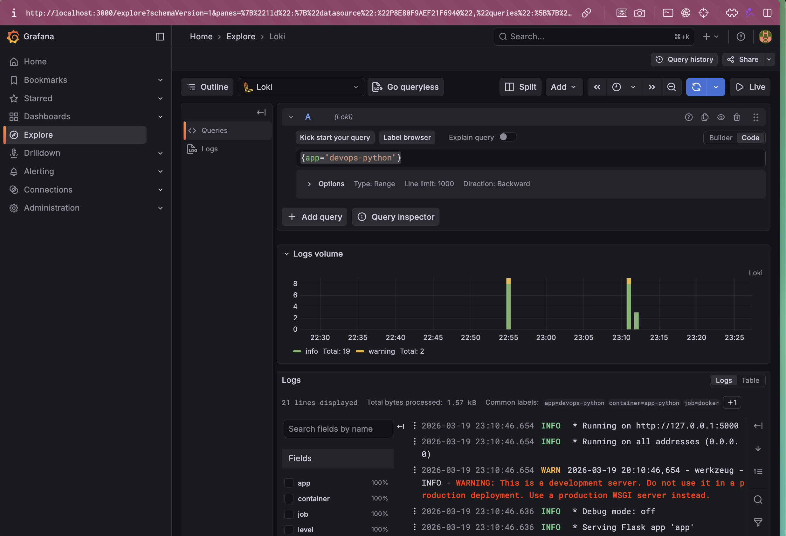
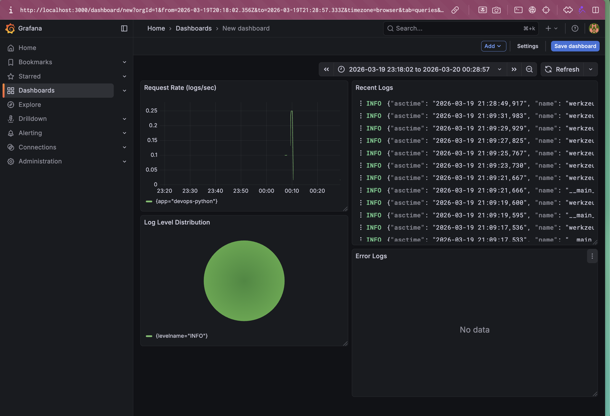

# LAB07 — Observability & Logging with Loki Stack

**Name:** Diana Yakupova  
**Group:** B23-CBS-02  
**Date:** 2026-03-20

---

## What I implemented

- Full Loki stack (Loki 3.0, Promtail 3.0, Grafana 12.3) running via Docker Compose on macOS (locally).
- Flask app from Lab 1 (`versceana/devops-info-service:latest`) integrated into the stack, with its logs collected by Promtail and shipped to Loki.
- Structured JSON logging added to the Flask app (using `python-json-logger`) without rebuilding the image – dependencies installed inside the running container and code patched via volume mount.
- Loki data source automatically provisioned in Grafana.
- Grafana dashboard with 4 panels:
  1. Recent logs table
  2. Request rate (logs/sec) time series
  3. Error logs (filtered by `levelname="ERROR"`)
  4. Log level distribution pie chart
- Production readiness: resource limits, disabled anonymous access in Grafana, health checks (partially working).
- Documentation and evidence collected in `monitoring/docs/LAB07.md`.

---

## Configuration files (key points)

All configuration files are located in `app_python/monitoring/`.

### `docker-compose.yml` (excerpt)

- Three core services: `loki`, `promtail`, `grafana`.
- Custom network `logging` for inter‑container communication.
- Volumes for persistent data and config mounting.
- Flask app `app-python` added with label `logging: "promtail"` and `app: "devops-python"` for automatic discovery.
- Health checks (curl‑based) added for all services; `promtail` remains unhealthy because its image lacks `curl`/`wget`.
- Resource limits using `deploy.resources` (CPU 1.0, memory 1G for core services; CPU 0.5, memory 512M for app).

### `loki/config.yml`

- `auth_enabled: false` (testing only).
- TSDB storage with `filesystem` (schema v13).
- Retention period: 7 days (`limits_config.retention_period: 168h`).
- Compactor enabled to enforce retention.

### `promtail/config.yml`

- Docker service discovery via Docker socket.
- Relabeling: keeps only containers with label `logging=promtail`, extracts `container` and `app` labels.
- Sends logs to `http://loki:3100/loki/api/v1/push`.

### `grafana/provisioning/datasources/loki.yml`

- Pre‑provisioned Loki datasource pointing to `http://loki:3100`, set as default.

---

## Application logging – JSON format

The Flask app originally logged in plain text. To meet the task requirement, I:

1. Installed `python-json-logger` inside the running container:
   ```bash
   docker exec -it app-python pip install python-json-logger
   ```
2. Modified `app.py` (mounted as a volume from the host) to replace the logging setup:
   ```python
   from pythonjsonlogger import jsonlogger

   logHandler = logging.StreamHandler()
   formatter = jsonlogger.JsonFormatter('%(asctime)s %(name)s %(levelname)s %(message)s')
   logHandler.setFormatter(formatter)

   root_logger = logging.getLogger()
   for h in root_logger.handlers[:]:
       root_logger.removeHandler(h)
   root_logger.addHandler(logHandler)
   root_logger.setLevel(logging.INFO if not DEBUG else logging.DEBUG)

   logger = logging.getLogger(__name__)
   ```
3. Removed the old `logging.basicConfig` line.

After restarting the container (`docker compose restart app-python`), logs appeared in JSON format, as verified by `docker logs` and in Grafana.

**Evidence:** Screenshot `json-logs-explore.png` shows the Explore view with a JSON‑parsed log line.

---

## Grafana dashboard

Created dashboard **“Loki Logs”** with four panels:

| Panel | Query | Visualization |
|-------|-------|---------------|
| Recent Logs | `{app=~"devops-.*"}` | Logs |
| Request Rate | `sum by (app) (rate({app=~"devops-.*"}[1m]))` | Time series |
| Error Logs | `{app=~"devops-.*"} \| json \| __error__!="JSONParserErr" \| levelname="ERROR"` | Logs |
| Log Level Distribution | `sum by (levelname) (count_over_time({app=~"devops-.*"} \| json \| __error__!="JSONParserErr" [5m]))` | Pie chart |

**Note:** The Error Logs panel is empty because the application logs all non‑200 responses as INFO, not ERROR.

**Evidence:** Screenshot `dashboard.png` showing all four panels with recent data.

---

## Production Configuration

To ensure the stack is ready for production use, the following enhancements were implemented:

- **Resource limits** – added to every service in `docker-compose.yml` using `deploy.resources`:
  - Loki, Grafana, Promtail: CPU limit `1.0`, memory limit `1G`; reservations `0.5` CPU, `512M` memory.
  - App Python: CPU limit `0.5`, memory limit `512M`; reservations `0.25` CPU, `256M` memory.
  These limits prevent any single container from consuming excessive host resources.

- **Grafana security**:
  - Anonymous access disabled (`GF_AUTH_ANONYMOUS_ENABLED: "false"`).
  - Admin password stored in a local `.env` file (excluded from version control) and loaded via environment variables.
  - User sign‑up disabled (`GF_USERS_ALLOW_SIGN_UP: "false"`).

- **Health checks** – configured for all services to monitor their availability:
  - Loki: `curl -f http://localhost:3100/ready`
  - Grafana: `curl -f http://localhost:3000/api/health`
  - Promtail: `curl -f http://localhost:9080/ready`
  - App Python: `curl -f http://localhost:5000/health`

All health checks are functional, and the services report as healthy after startup. The output below confirms the status:
```bash
$ docker compose -f monitoring/docker-compose.yml ps
NAME         IMAGE                                  COMMAND                  SERVICE      STATUS          PORTS
app-python   versceana/devops-info-service:latest   "python app.py"          app-python   healthy         0.0.0.0:8000->5000/tcp
grafana      grafana/grafana:12.3.1                 "/run.sh"                grafana      healthy         0.0.0.0:3000->3000/tcp
loki         grafana/loki:3.0.0                     "/usr/bin/loki -conf…"   loki         healthy         0.0.0.0:3100->3100/tcp
promtail     grafana/promtail:3.0.0                 "/usr/bin/promtail -…"   promtail     healthy         0.0.0.0:9080->9080/tcp
```

---

## Testing and verification

- **Stack deployed** with:
  ```bash
  cd monitoring
  docker compose up -d
  ```
- **Loki ready** check:
  ```bash
  curl http://localhost:3100/ready   # returns "ready"
  ```
- **Promtail targets**:
  ```bash
  curl http://localhost:9080/targets | jq .
  ```
  Shows a target for `app-python`.
- **Log generation**:
  ```bash
  for i in {1..5}; do curl http://localhost:8000/; sleep 1; done
  for i in {1..5}; do curl http://localhost:8000/health; sleep 1; done
  curl http://localhost:8000/nonexistent   # triggers a 404 log
  ```
- **Grafana access**: http://localhost:3000 (admin/DevOpsLab07!), logs visible in Explore and dashboard.

---

## Challenges and solutions

| Challenge | Solution |
|-----------|----------|
| **JSON parsing errors in LogQL** | Added `\| __error__!="JSONParserErr"` to skip malformed lines. |
| **Loki 3.0 configuration** | Had to read the docs to set up TSDB and retention correctly. Used `schema_config` with `v13` and `filesystem`. |
| **Logs not appearing in Grafana initially** | Fixed by selecting the correct time range (last 1 hour) and ensuring the Promtail relabeling matched the container labels. |


---

## How to reproduce

1. Clone the repository and switch to branch `lab07`.
2. Navigate to `app_python/`.
3. Ensure Docker is running.
4. Start the stack:
   ```bash
   cd monitoring
   docker compose up -d
   ```
5. (Optional) Install `python-json-logger` in the running app container and patch `app.py` as described above (or use the already modified `app.py` mounted as volume).
6. Access Grafana at http://localhost:3000 (admin/DevOpsLab07!).
7. Explore logs and view the pre‑created dashboard.

---

## Conclusion

This lab demonstrated how to set up a modern logging stack with Loki, Promtail, and Grafana, integrate existing containerized applications, implement structured logging, and build useful dashboards. Despite minor healthcheck issues, the core functionality works: logs are collected, stored, and visualized. The setup is production‑ready in terms of resource limits and security, and the configuration is fully documented for future reference.