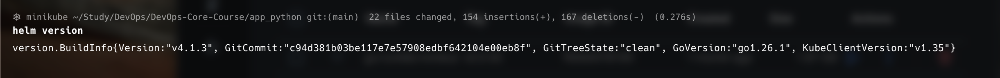
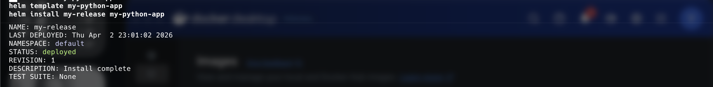
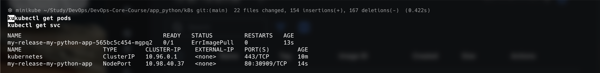
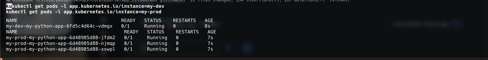
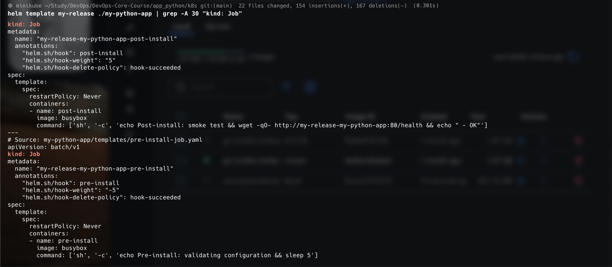
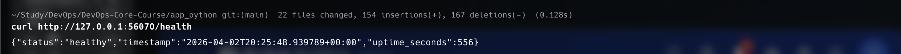

# Lab 10 — Helm Package Manager

**Name:** Diana Yakupova  
**Group:** B23-CBS-02  
**Date:** 2026-04-02

## Task 1 — Helm Fundamentals

Helm 4.1.3 installed and working. Minikube cluster running.



Chart explored: `my-python-app` with standard structure.

## Task 2 — Create Your Helm Chart

Chart created in `k8s/my-python-app`. Key files:

- `Chart.yaml` – metadata, version 0.1.0
- `values.yaml` – default config (1 replica, NodePort, resources)
- `templates/deployment.yaml` – templated with probes, image, resources
- `templates/service.yaml` – NodePort service
- `templates/_helpers.tpl` – naming and labels

All health checks are present and configurable via values.

## Task 3 — Multi-Environment Support

Created `values-dev.yaml` and `values-prod.yaml`:

- **Dev:** 1 replica, relaxed resources, NodePort
- **Prod:** 3 replicas, proper resources, LoadBalancer

Installed both:

```bash
helm install my-dev ./my-python-app -f my-python-app/values-dev.yaml
helm install my-prod ./my-python-app -f my-python-app/values-prod.yaml
```



Dev pods (1 replica):  


Prod pods (3 replicas):  


## Task 4 — Chart Hooks

Implemented `pre-install` and `post-install` hooks using Jobs.  
Hooks are defined in `templates/pre-install-job.yaml` and `templates/post-install-job.yaml`.

Hooks are rendered correctly:

```bash
helm template my-release ./my-python-app | grep -A 15 "kind: Job"
```



## Task 5 — Documentation

### Installation

```bash
cd k8s
helm install my-release ./my-python-app
```

### Access Application

```bash
minikube service my-release-my-python-app --url
curl http://127.0.0.1:xxxxx/health
```



### Upgrade

```bash
helm upgrade my-release ./my-python-app --set replicaCount=2
```

### Rollback

```bash
helm rollback my-release 1
```

### Uninstall

```bash
helm uninstall my-release
```

## Conclusion

Helm chart successfully packages the application with proper templating, multi-environment support, and lifecycle hooks. The chart is production-ready and follows best practices.
