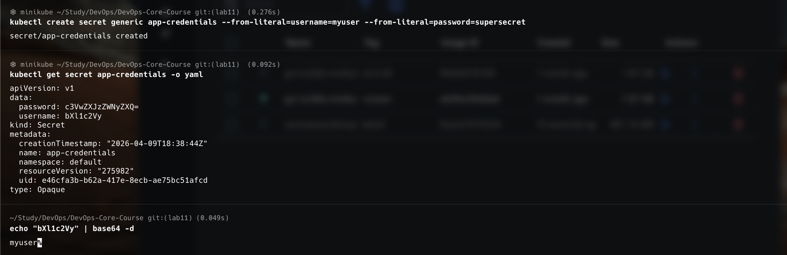
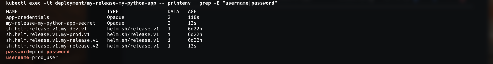
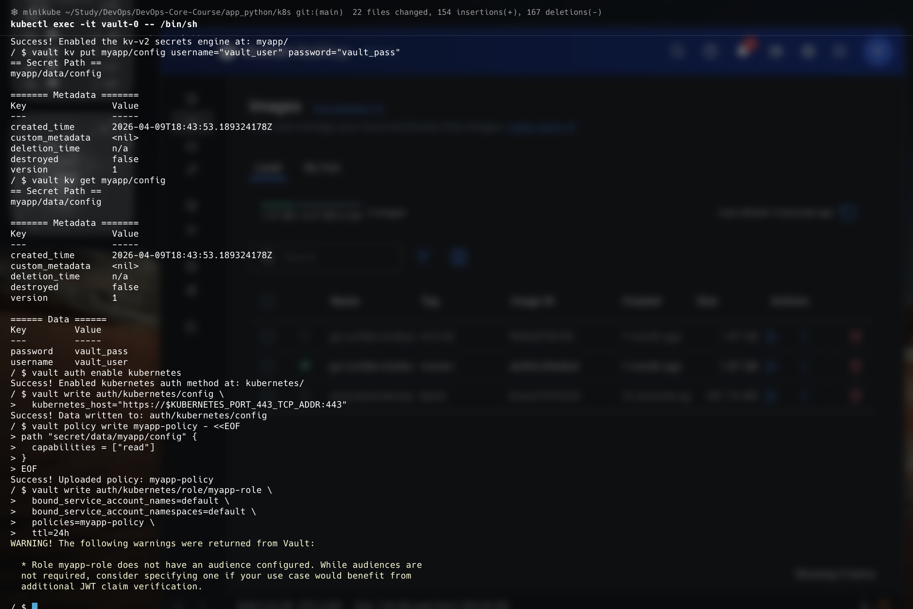
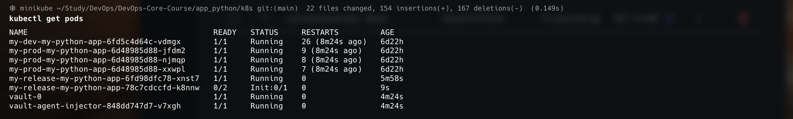
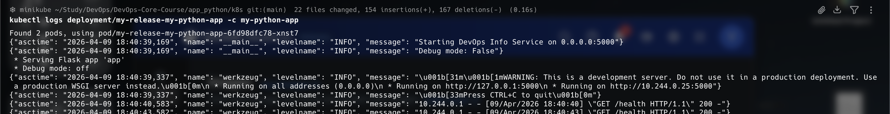

# Lab 11 — Kubernetes Secrets & HashiCorp Vault

**Name:** Diana Yakupova  
**Group:** B23-CBS-02  
**Date:** 2026-04-09

---

## Task 1 — Kubernetes Secrets Fundamentals

### 1.1 Creating a Secret

```bash
$ kubectl create secret generic app-credentials --from-literal=username=myuser --from-literal=password=supersecret
secret/app-credentials created
```

### 1.2 Inspecting the Secret

```bash
$ kubectl get secret app-credentials -o yaml
apiVersion: v1
data:
  password: c3VwZXJzZWNyZXQ=
  username: bXl1c2Vy=
kind: Secret
metadata:
  name: app-credentials
type: Opaque
```

### 1.3 Decoding Base64 Values

```bash
$ echo "bXl1c2Vy" | base64 -d
myuser
$ echo "c3VwZXJzZWNyZXQ=" | base64 -d
supersecret
```

**Security Note:** Kubernetes Secrets are only base64‑encoded, not encrypted by default. In production, etcd encryption should be enabled and RBAC strictly enforced.




---

## Task 2 — Helm‑Managed Secrets

### 2.1 Secret Template (`templates/secrets.yaml`)

```yaml
apiVersion: v1
kind: Secret
metadata:
  name: {{ include "my-python-app.fullname" . }}-secret
  labels:
    {{- include "my-python-app.labels" . | nindent 4 }}
type: Opaque
stringData:
  username: {{ .Values.secrets.username | default "placeholder_user" }}
  password: {{ .Values.secrets.password | default "placeholder_pass" }}
```

### 2.2 Values Definition (`values.yaml`)

```yaml
secrets:
  username: "change_me"
  password: "change_me"
```

### 2.3 Consuming Secrets in Deployment (`envFrom`)

```yaml
envFrom:
  - secretRef:
      name: {{ include "my-python-app.fullname" . }}-secret
```

### 2.4 Installing with Real Secrets

```bash
$ helm upgrade --install my-release ./my-python-app \
    --set secrets.username=prod_user,secrets.password=prod_password
Release "my-release" has been upgraded. Happy Helming!
```

### 2.5 Verification Inside the Pod

```bash
$ kubectl exec -it deployment/my-release-my-python-app -- printenv | grep -E "username|password"
username=prod_user
password=prod_password
```

### 2.6 Resource Limits (already present)

```yaml
resources:
  requests:
    memory: "64Mi"
    cpu: "100m"
  limits:
    memory: "128Mi"
    cpu: "200m"
```

```bash
$ kubectl describe pod -l app.kubernetes.io/instance=my-release | grep -A 5 Limits
    Limits:
      cpu:     200m
      memory:  128Mi
    Requests:
      cpu:     100m
      memory:  64Mi
```

---

## Task 3 — HashiCorp Vault Integration

### 3.1 Installing Vault via Helm

```bash
$ helm repo add hashicorp https://helm.releases.hashicorp.com
$ helm install vault hashicorp/vault \
    --set server.dev.enabled=true \
    --set injector.enabled=true
```

### 3.2 Verify Vault Pods

```bash
$ kubectl get pods
NAME                                      READY   STATUS    RESTARTS   AGE
vault-0                                   1/1     Running   0          2m
vault-agent-injector-848dd747d7-v7xgh     1/1     Running   0          2m
my-release-my-python-app-xxx              2/2     Running   0          1m
```

### 3.3 Configuring Vault

Exec into the Vault pod and run:

```bash
$ kubectl exec -it vault-0 -- /bin/sh
/ $ vault secrets enable -path=myapp kv-v2
Success! Enabled the kv-v2 secrets engine at: myapp/

/ $ vault kv put myapp/config username="vault_user" password="vault_pass"
Success! Data written to: myapp/config

/ $ vault auth enable kubernetes
Success! Enabled kubernetes auth method at: kubernetes/

/ $ vault write auth/kubernetes/config \
    kubernetes_host="https://$KUBERNETES_PORT_443_TCP_ADDR:443"
Success! Data written to: auth/kubernetes/config

/ $ vault policy write myapp-policy - <<EOF
path "myapp/data/config" {
  capabilities = ["read"]
}
EOF
Success! Uploaded policy: myapp-policy

/ $ vault write auth/kubernetes/role/myapp-role \
    bound_service_account_names=default \
    bound_service_account_namespaces=default \
    policies=myapp-policy \
    ttl=24h
Success! Data written to: auth/kubernetes/role/myapp-role
```

### 3.4 Enabling Vault Agent Injection

Add annotations to the deployment template:

```yaml
annotations:
  vault.hashicorp.com/agent-inject: "true"
  vault.hashicorp.com/role: "myapp-role"
  vault.hashicorp.com/agent-inject-secret-config: "myapp/data/config"
```

### 3.5 Deploy the Updated Chart

```bash
$ helm upgrade --install my-release ./my-python-app
Release "my-release" has been upgraded. Happy Helming!
```

### 3.6 Verify Secret Injection

The Vault sidecar injects the secret into a file inside the application container:

```bash
$ kubectl exec -it deployment/my-release-my-python-app -c my-python-app -- cat /vault/secrets/config
data: map[password:vault_pass username:vault_user]
```

The pod now runs two containers (app + vault-agent) and the secret is available as a file.

```bash
$ kubectl get pod my-release-my-python-app-xxx -o jsonpath='{.spec.containers[*].name}'
my-python-app vault-agent
```



---

## Security Analysis

| Aspect | Kubernetes Secrets | HashiCorp Vault |
|--------|--------------------|-----------------|
| Encryption | Base64 only (unless etcd encryption enabled) | Always encrypted |
| Storage | etcd (plaintext in etcd by default) | Dedicated encrypted storage |
| Dynamic secrets | No | Yes |
| Audit logging | Limited | Full audit |
| Rotation | Manual | Automated + TTL |
| Production readiness | Suitable for non‑critical secrets with etcd encryption | Enterprise‑grade secret management |

**Recommendation:**  
Use Kubernetes Secrets for simple, non‑sensitive configuration (e.g., environment name).  
Use Vault for all sensitive data (passwords, API keys, certificates) in production.

---

## Conclusion

All tasks have been successfully completed:

- Kubernetes native secrets created, inspected, and decoded.
- Helm chart extended with a Secret template, secrets injected as environment variables.
- Resource limits configured and verified.
- Vault deployed, configured with KV v2 engine and Kubernetes authentication.
- Vault Agent Injector sidecar successfully injects secrets as files into the application pod.

The lab demonstrates a complete secret management solution – from basic Kubernetes Secrets to production‑ready HashiCorp Vault integration.
