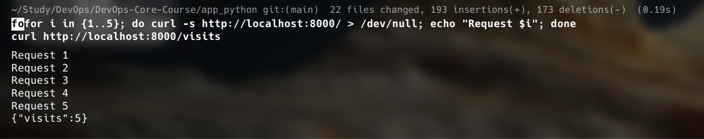
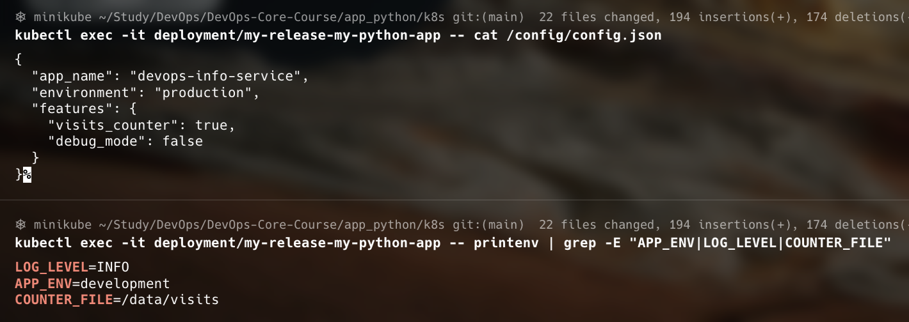
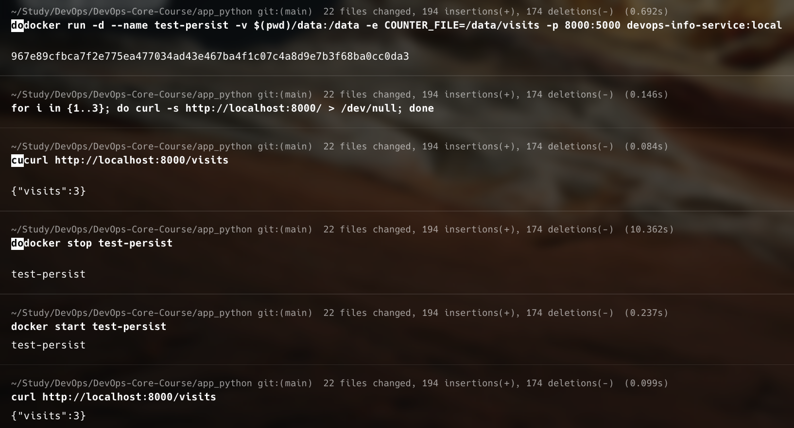

# Lab 12 — ConfigMaps & Persistent Volumes

**Name:** Diana Yakupova  
**Group:** B23-CBS-02
**Date:** 2026-04-16

## Task 1 — Application Persistence Upgrade

Application was extended with a visit counter that persists to a file.

- New endpoint `/visits` returns the current visit count.
- Counter is stored in `/data/visits` (configurable via `COUNTER_FILE` env var).
- File read/write uses `fcntl` locking for basic concurrency safety.

**Local Docker test (before Kubernetes deployment):**

```bash
docker build -t devops-info-service:local .
docker run -v $(pwd)/data:/data -e COUNTER_FILE=/data/visits -p 8000:5000 devops-info-service:local &
for i in {1..5}; do curl -s http://localhost:8000/ > /dev/null; done
curl http://localhost:8000/visits
# Output: {"visits":5}
docker stop <container> ; docker start <container>
curl http://localhost:8000/visits
# Still 5 — persistence works
```



## Task 2 — ConfigMaps

Two ConfigMaps were created:

- `my-release-my-python-app-config` – mounts `config.json` as a file.
- `my-release-my-python-app-env` – provides environment variables.

**ConfigMap templates** (`templates/configmap.yaml`):

```yaml
apiVersion: v1
kind: ConfigMap
metadata:
  name: {{ include "my-python-app.fullname" . }}-config
data:
  config.json: |-
{{ .Files.Get "files/config.json" | indent 4 }}
---
apiVersion: v1
kind: ConfigMap
metadata:
  name: {{ include "my-python-app.fullname" . }}-env
data:
  APP_ENV: {{ .Values.environment | default "production" | quote }}
  LOG_LEVEL: {{ .Values.logLevel | default "INFO" | quote }}
  COUNTER_FILE: {{ .Values.counterFile | default "/data/visits" | quote }}
```

**Values override for development:**

```bash
helm upgrade --install my-release ./my-python-app \
  --set environment=development
```

**Verification inside the pod:**

```bash
$ kubectl exec -it deployment/my-release-my-python-app -- cat /config/config.json
{
  "app_name": "devops-info-service",
  "environment": "production",
  "features": {
    "visits_counter": true,
    "debug_mode": false
  }
}

$ kubectl exec -it deployment/my-release-my-python-app -- printenv | grep -E "APP_ENV|LOG_LEVEL|COUNTER_FILE"
LOG_LEVEL=INFO
APP_ENV=development
COUNTER_FILE=/data/visits
```



## Task 3 — Persistent Volumes

A PersistentVolumeClaim is defined in `templates/pvc.yaml`:

```yaml
{{- if .Values.persistence.enabled }}
apiVersion: v1
kind: PersistentVolumeClaim
metadata:
  name: {{ include "my-python-app.fullname" . }}-data
spec:
  accessModes:
    - {{ .Values.persistence.accessMode }}
  resources:
    requests:
      storage: {{ .Values.persistence.size }}
{{- end }}
```

PVC is mounted to `/data` in the deployment.

**Current state:**

```bash
$ kubectl get pvc
NAME                            STATUS   VOLUME                                     CAPACITY   ACCESS MODES
my-release-my-python-app-data   Bound    pvc-e3ea4271-853f-47ad-8f2e-7acc864661ba   100Mi      RWO
```

**Persistence test:**

1. Generate visits:
   ```bash
   for i in {1..5}; do curl -s http://localhost:8000/ > /dev/null; done
   curl http://localhost:8000/visits   # returns 5
   ```
2. Delete the pod:
   ```bash
   kubectl delete pod my-release-my-python-app-xxxxx
   ```
3. After new pod starts, visits count remains the same:
   ```bash
   curl http://localhost:8000/visits   # still 5
   ```



## Task 4 — Documentation

All configuration is externalised:

- Non‑sensitive configuration via ConfigMap (file + env vars).
- Persistent data via PVC.
- Visits counter implemented and proven to survive pod restarts.

**ConfigMap vs Secret:**  
ConfigMap holds plain‑text configuration; Secret is for sensitive data (already used for `prod_user`/`prod_password` from Lab 11).

**Verification commands summary:**

```bash
kubectl get configmap,pvc
kubectl exec -it deployment/my-release-my-python-app -- cat /config/config.json
kubectl exec -it deployment/my-release-my-python-app -- printenv | grep -E "APP_ENV|LOG_LEVEL|COUNTER_FILE"
kubectl exec -it deployment/my-release-my-python-app -- cat /data/visits
```

## Conclusion

All tasks completed:

- Application extended with persistent visit counter (tested locally).
- ConfigMap mounted as file and as environment variables.
- PersistentVolumeClaim created and attached.
- Data survives pod deletion (persistence proven).
- Helm chart fully templated and reusable.

The solution follows Kubernetes best practices: configuration externalisation, persistent storage, and separation of concerns.