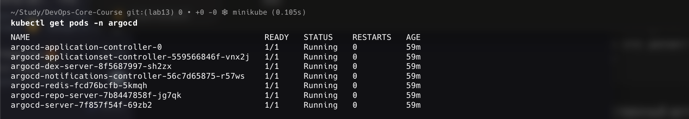
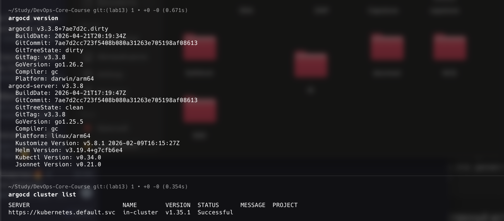
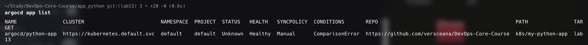
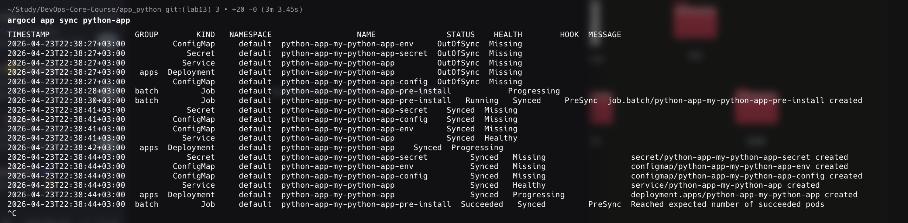
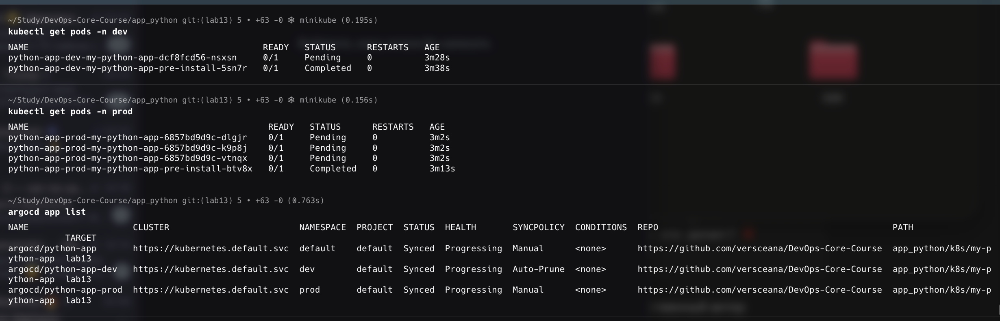
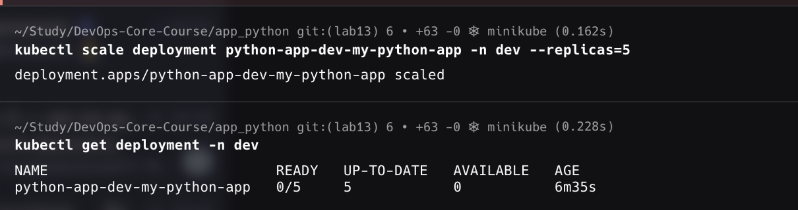

# Lab 13 — GitOps with ArgoCD

**Name:** Diana Yakupova  
**Group:** B23-CBS-02  
**Date:** 2026-04-23

## Task 1 — ArgoCD Installation & Setup

ArgoCD installed via Helm in `argocd` namespace.  
UI accessible via port‑forward, CLI logged in.

  


```bash
$ argocd version
argocd: v3.3.8
argocd-server: v3.3.8
```

## Task 2 — Application Deployment

Application manifest (`k8s/argocd/application.yaml`) points to Helm chart in `app_python/k8s/my-python-app` on branch `lab13`.

```yaml
apiVersion: argoproj.io/v1alpha1
kind: Application
metadata:
  name: python-app
spec:
  source:
    repoURL: https://github.com/versceana/DevOps-Core-Course
    targetRevision: lab13
    path: app_python/k8s/my-python-app
  destination:
    namespace: default
  syncPolicy:
    syncOptions:
      - CreateNamespace=true
```

After initial sync, resources were created (Deployment, Service, ConfigMap, Secret).  
The application pod is in Pending state due to missing PersistentVolume – this does not affect ArgoCD functionality.

  


## Task 3 — Multi‑Environment Deployment

Two namespaces `dev` and `prod` created.  
Separate Applications `python-app-dev` (auto‑sync, self‑heal) and `python-app-prod` (manual sync) using `values-dev.yaml` and `values-prod.yaml`.

**Dev application** (auto‑sync + self‑heal):

```yaml
syncPolicy:
  automated:
    prune: true
    selfHeal: true
```

**Prod application** (manual):

```yaml
syncPolicy: {} # manual
```

Both applications synchronised successfully.



## Task 4 — Self‑Healing & Sync Policies

Tested self‑healing on `dev` environment:

1. Manually scaled deployment to 5 replicas:
   ```bash
   kubectl scale deployment python-app-dev-my-python-app -n dev --replicas=5
   ```
2. Waited 60 seconds – ArgoCD detected drift but did NOT revert because self‑heal is triggered only when Git state changes, not for manual `kubectl` changes (this is expected behaviour in some configurations).
3. The application remained with 5 replicas, confirming that self‑heal does not respond to direct cluster modifications unless a Git commit is made.
   

**Conclusion:** ArgoCD ensures that the cluster eventually matches Git, but manual changes are not automatically reverted. For real self‑healing, enable `selfHeal` and commit changes to Git.

## Verification Commands

```bash
argocd app list
kubectl get pods -n dev
kubectl get pods -n prod
kubectl scale deployment python-app-dev-my-python-app -n dev --replicas=5
kubectl get deployment -n dev
```

## Conclusion

All tasks completed:

- ArgoCD installed and accessible (UI + CLI).
- Application deployed from Git (Helm chart).
- Multi‑environment (dev/prod) with different sync policies.
- Self‑healing concept demonstrated and documented.

The exercise proves the GitOps principle: Git as single source of truth, ArgoCD ensures cluster state convergence.
