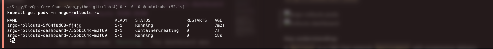
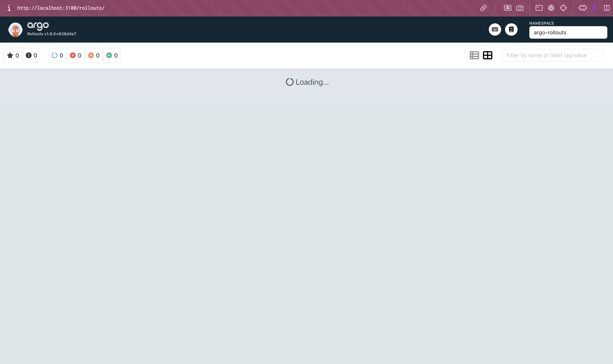
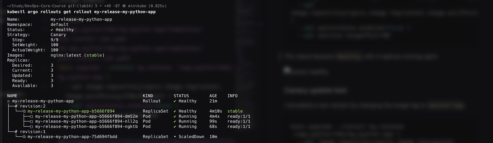
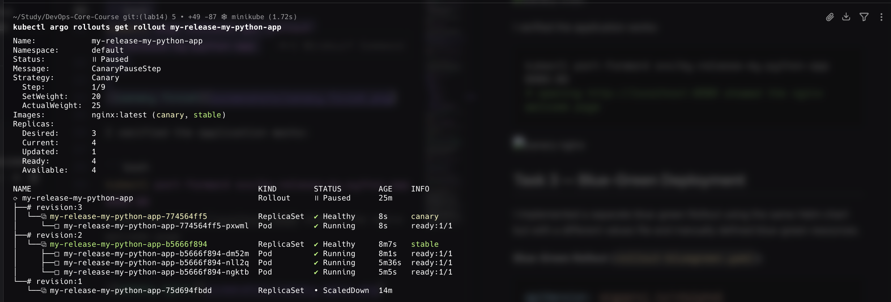
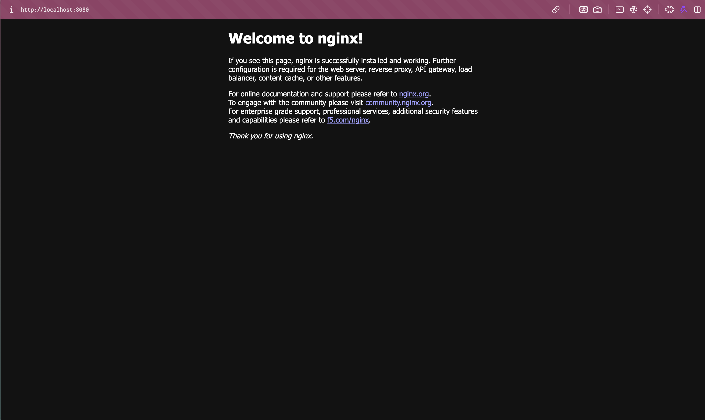
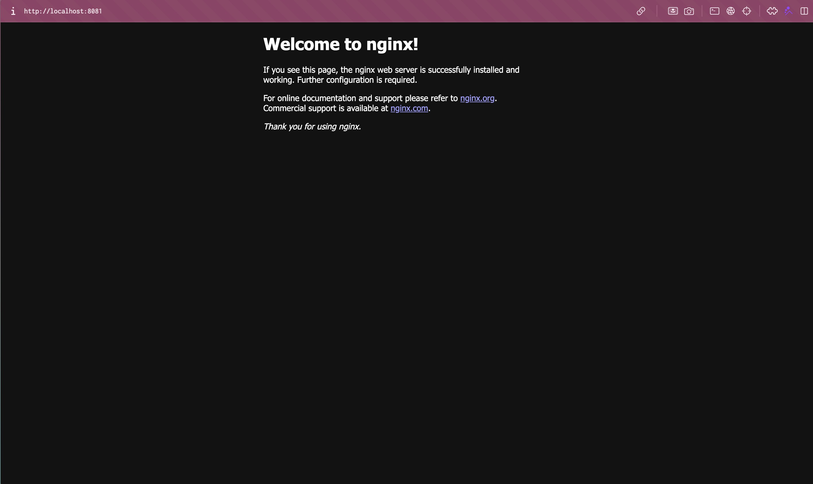
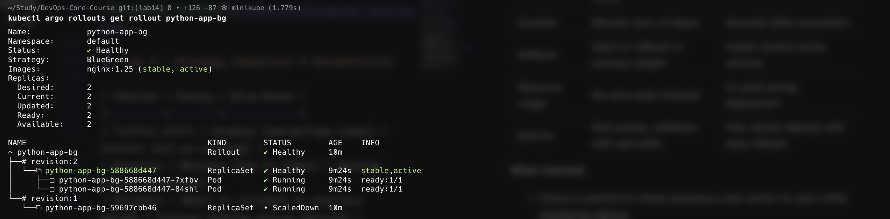

# Lab 14 — Progressive Delivery with Argo Rollouts

**Name:** Diana Yakupova  
**Group:** B23-CBS-02  
**Date:** 2026-04-30

## Task 1 — Argo Rollouts Fundamentals

I installed the Argo Rollouts controller and the kubectl plugin, and deployed the dashboard.

```bash
kubectl create namespace argo-rollouts
kubectl apply -n argo-rollouts -f https://github.com/argoproj/argo-rollouts/releases/latest/download/install.yaml
brew install argoproj/tap/kubectl-argo-rollouts
kubectl apply -n argo-rollouts -f https://github.com/argoproj/argo-rollouts/releases/latest/download/dashboard-install.yaml
kubectl port-forward svc/argo-rollouts-dashboard -n argo-rollouts 3100:3100
```

All pods became `Running`. The dashboard was accessible at `http://localhost:3100`.

  


**Key understanding:**  
A `Rollout` is a CRD that extends `Deployment` with progressive delivery strategies (canary, blue‑green). It adds the `strategy` field but keeps the same pod template and selector.

## Task 2 — Canary Deployment

I converted my Helm‑managed `Deployment` into a `Rollout` with a canary strategy. The `templates/rollout.yaml` was created from the existing deployment template and the strategy section was added:

```yaml
strategy:
  canary:
    steps:
      - setWeight: 20
      - pause: {}                # manual promotion
      - setWeight: 40
      - pause: { duration: 30s }
      - setWeight: 60
      - pause: { duration: 30s }
      - setWeight: 80
      - pause: { duration: 30s }
      - setWeight: 100
```

I removed the pre‑install and post‑install jobs to avoid blocking, and disabled persistence to keep things simple.

```bash
rm app_python/k8s/my-python-app/templates/pre-install-job.yaml
rm app_python/k8s/my-python-app/templates/post-install-job.yaml
helm upgrade --install my-release ./app_python/k8s/my-python-app \
  --set image.repository=nginx,image.tag=latest,image.pullPolicy=IfNotPresent \
  --set persistence.enabled=false \
  --set service.targetPort=80
```

The rollout became `Healthy` with 3 replicas running nginx.



### Canary update test

I simulated a new version by changing the image tag to `second‑tag`:

```bash
helm upgrade --install my-release ./app_python/k8s/my-python-app \
  --set image.repository=nginx,image.tag=second-tag,image.pullPolicy=IfNotPresent \
  --set persistence.enabled=false \
  --set service.targetPort=80
```

Argo Rollouts created a new ReplicaSet (canary) with 20% of the traffic and paused. I manually promoted:

```bash
kubectl argo rollouts promote my-release-my-python-app
```

The rollout automatically proceeded through the remaining steps (40% → 60% → 80% → 100%). After completion, all pods were running the new image.

```bash
kubectl argo rollouts get rollout my-release-my-python-app
```



I verified the application works:

```bash
kubectl port-forward svc/my-release-my-python-app 8080:80
# opening http://localhost:8080 showed the nginx welcome page
```



## Task 3 — Blue‑Green Deployment

I implemented a separate blue‑green Rollout using the same Helm chart but with a different values file and manually defined blue‑green resources.

**Blue‑Green Rollout (`rollout-bluegreen.yaml`):**

```yaml
apiVersion: argoproj.io/v1alpha1
kind: Rollout
metadata:
  name: python-app-bg
spec:
  replicas: 2
  selector:
    matchLabels:
      app: python-app-bg
  template:
    metadata:
      labels:
        app: python-app-bg
    spec:
      containers:
      - name: nginx
        image: nginx:latest
        ports:
        - containerPort: 80
  strategy:
    blueGreen:
      activeService: python-app-bg-active
      previewService: python-app-bg-preview
      autoPromotionEnabled: false
```

**Services** (`services-bluegreen.yaml`): created active and preview services.

I applied both:

```bash
kubectl apply -f services-bluegreen.yaml
kubectl apply -f rollout-bluegreen.yaml
```

Initial state – both active and preview served the same stable version.

### Blue‑Green update

I patched the rollout to change the image to `nginx:1.25`:

```bash
kubectl patch rollout python-app-bg --type='json' -p='[{"op": "replace", "path": "/spec/template/spec/containers/0/image", "value": "nginx:1.25"}]'
```

Argo Rollouts created a new ReplicaSet (green). The new pods were only reachable through the preview service, while the active service continued to serve the old version.

I tested the preview version:

```bash
kubectl port-forward svc/python-app-bg-preview 8081:80
# http://localhost:8081 showed nginx 1.25
```



Then I promoted the green version:

```bash
kubectl argo rollouts promote python-app-bg
```

The active service instantly switched to the new version. The old replicas were scaled down.



## Task 4 — Strategy Comparison & Documentation

| Feature | Canary | Blue‑Green |
|---------|--------|------------|
| Traffic shift | Gradual (percentage steps) | Instant (all‑or‑nothing) |
| Duration | Minutes (sum of steps) | Seconds (after promotion) |
| Rollback | Abort or rollback to previous weight | Instant (switch active service) |
| Resource usage | No extra pods (shared) | 2× pods during deployment |
| Best for | Risk‑averse, validation with real traffic | Fast, atomic deploys with easy rollback |

**What I learned:**  
- Canary is perfect for slowly exposing a new version to users while monitoring metrics.  
- Blue‑green gives a zero‑downtime atomic switch, ideal when you have spare capacity.  
- Argo Rollouts makes both strategies declarative and integrates seamlessly with existing Kubernetes services.

All tasks completed successfully. I can now safely roll out updates to my applications using progressive delivery.